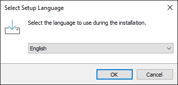
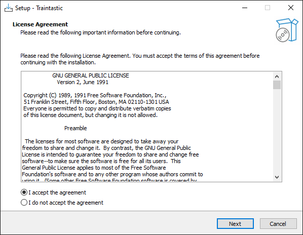
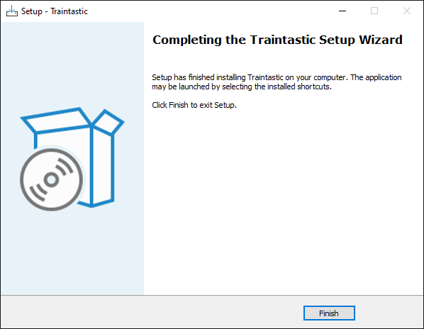

# Windows-Installation

Die Installation von Traintastic unter Windows dauert nur wenige Minuten.
Der Installer wird heruntergeladen, ggf. von Windows Defender bestätigt und anschließend über einen Assistenten eingerichtet. Diese Anleitung führt Schritt für Schritt durch den gesamten Prozess mit Screenshots.

Die aktuelle Version kann von [traintastic.org/download](https://traintastic.org/download) heruntergeladen werden. Danach den Installer starten und den folgenden Schritten folgen.

---

## Schritt 1: Windows Defender

Windows kann eine Warnung anzeigen, da Traintastic derzeit noch nicht signiert ist. Das ist normal und kein Grund zur Sorge.  
Auf *Weitere Informationen* klicken, um Details anzuzeigen.

## Schritt 2: Windows Defender

Auf *Trotzdem ausführen* klicken, um die Installation zu starten.

## Schritt 3: Benutzerkontensteuerung

Mit *Ja* bestätigen, um den Installer zu erlauben.

## Schritt 4: Sprache auswählen

Die gewünschte Sprache für den Installationsassistenten auswählen und mit *OK* bestätigen.  
Diese Sprache wird später auch in Traintastic verwendet.

## Schritt 5: Lizenzvereinbarung

*Ich stimme der Vereinbarung zu* auswählen und auf *Weiter* klicken.

## Schritt 6: Komponenten auswählen

Installationsart auswählen:

- **Client und Server** – wenn dieser PC die Modellbahn steuern soll
- **Nur Client** – wenn dieser PC sich nur mit einem Traintastic-Server im Netzwerk verbindet

Anschließend auf *Weiter* klicken.

## Schritt 7: Desktop-Verknüpfungen und Firewall

- *Desktop-Verknüpfung erstellen* kann deaktiviert werden, falls keine Verknüpfung gewünscht ist.
- Firewall-Regeln werden automatisch hinzugefügt, damit andere Geräte im Netzwerk Traintastic erreichen können. Diese Option kann bei Bedarf deaktiviert werden.

Dann auf *Weiter* klicken.

## Schritt 8: Installationsbereit

Auf *Installieren* klicken, um die Installation zu starten.

## Schritt 9: Installation abgeschlossen

Auf *Fertigstellen* klicken, um den Installer zu beenden. Die Installation ist damit abgeschlossen.

---
Nach der Installation weiter mit: [Schnellstart-Serie](../quickstart/index.md).

