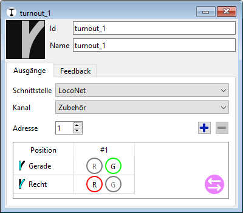

# Schnellstart: Weichensteuerung

Um die Anlage aus Traintastic heraus zu steuern, muss jede Weiche im Schema mit den entsprechenden digitalen Ausgängen verknüpft werden. Nach der Konfiguration kann Traintastic die Weiche direkt schalten und ihre Position automatisch aktualisieren, wenn die Zentrale eine Änderung meldet.

## Schritt 1: Weiche konfigurieren

- Sicherstellen, dass der **Bearbeitungsmodus** aktiv ist ( oben rechts).
- In der Werkzeugleiste das -Werkzeug auswählen.
- Auf eine **Weichen-Kachel** im Board klicken — der Eigenschaftsdialog der Weiche öffnet sich. \
    
- Die grundlegenden Weichenparameter eintragen:
    - Einen **Namen** vergeben (z. B. „Weiche 1“ oder „Gleisfeld Weiche“).
    - Das **ID-Feld** identifiziert die Weiche intern und kann unverändert bleiben (hauptsächlich für Skripting).
- Im Reiter **Ausgang** wird festgelegt, wie die Weiche gesteuert wird:
    - **Schnittstelle** — Die Zentrale bzw. das System, das diese Weiche steuert.
    - **Kanal** — In der Regel *Accessory*.
    - **Adresse** — Die digitale Adresse der Weiche in der Zentrale.
- Hat die Weiche mehrere Adressen (z. B. **Dreiwegweiche**, **Kreuzungsweiche** oder **Doppelkreuzungsweiche**), mit  weitere Adressen hinzufügen.
- Die **Ausgangszuordnung** legt fest, wie Traintastic die Weichenstellungen (z. B. *gerade* / *links* / *rechts*) auf Ausgänge abbildet.  
  Bei Standardweichen ist die Standardzuordnung in der Regel korrekt.

Nach Abschluss den Dialog schließen.

## Schritt 2: Weiche testen

- In den **Betriebsmodus** wechseln.
- Die Weiche im Schema anklicken, um ihre Stellung zu ändern.
- Die Weiche sollte sich auf der realen Anlage bewegen.

!!! tip "Falsche Richtung?"

Wenn sich die Weiche auf der Anlage entgegengesetzt zur Anzeige in Traintastic bewegt, wieder in den **Bearbeitungsmodus** wechseln und die Eigenschaften öffnen. 

Im Reiter **Ausgang** kann die **Richtungszuordnung vertauscht** werden – dadurch wird festgelegt, welcher Ausgang welcher Weichenstellung entspricht.  Bei Standardweichen mit einer Adresse geht das schnell über die -Schaltfläche.

---

Weiter: [Blöcke und Sensoren](blocks-sensors.md)