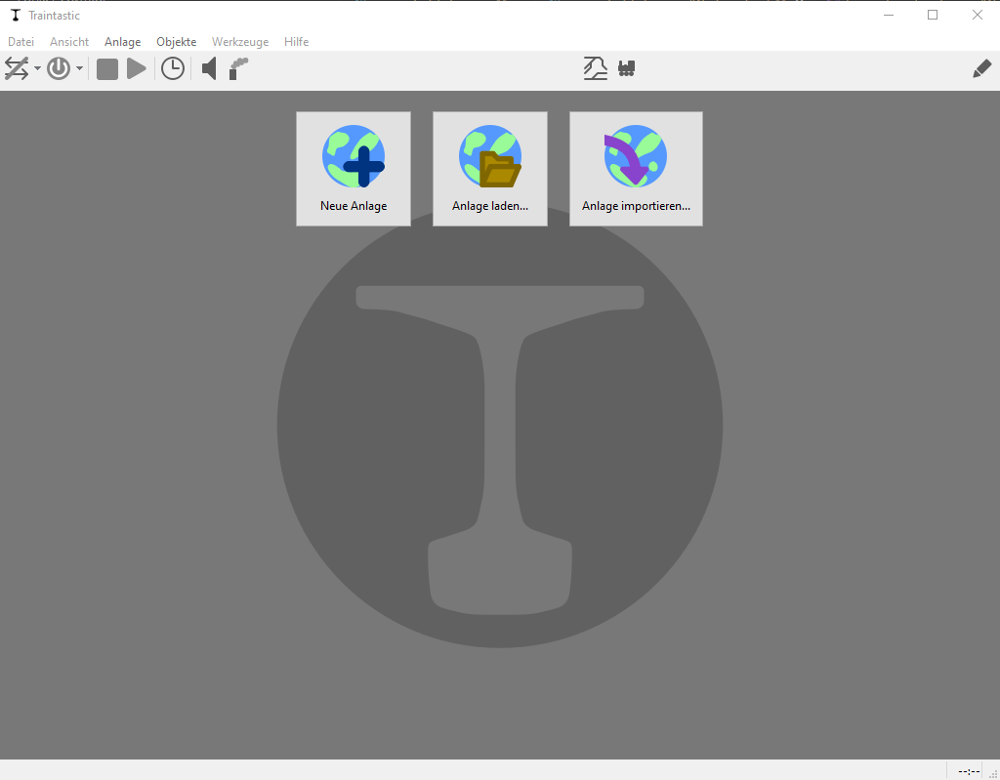
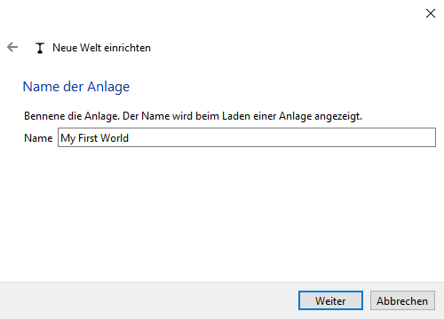
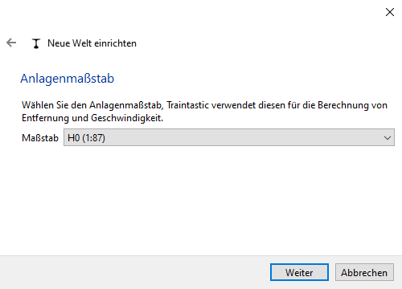
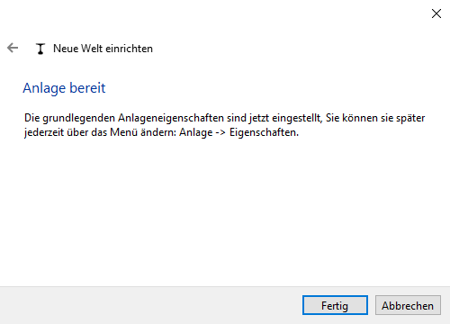

# Schnellstart: Erste Welt erstellen

In Traintastic beginnt alles mit einer **Welt**. Eine Welt ist deine Projektdatei – sie repräsentiert deine Modellbahnanlage mit Lokomotiven, Zubehör, Fahrstraßen und Automatisierung. Jeder Erbauer erstellt seine eigene Welt, so wie jede Modellbahn ihre eigene kleine Welt darstellt.

## Schritt 1: Server und Client starten

1. Den **Server** auf dem Computer (oder einem Gerät wie einem Raspberry Pi) starten.  
2. Den **Client** starten. Der Client sucht automatisch nach dem Server und verbindet sich.
3. Wenn Du ein AppImage verwendest, musst Du nur dieses Starten, da der Server und Client in dem AppImage enthalten ist.

Wenn auf dem Server keine Welt geladen ist (Standard bei einer frischen Installation), zeigt der Client drei Optionen:

- *Neue Welt* – eine neue Welt über einen Assistenten erstellen
- *Welt laden* – eine vorhandene, auf dem Server gespeicherte Welt öffnen
- *Welt importieren* – eine zuvor exportierte Weltdatei importieren

## Schritt 2: Neue Welt erstellen

Auf *Neue Welt* klicken, um den Assistenten zu starten:

1. Einen **Namen** für die Welt eingeben (z. B. *Meine erste Welt*). \
    
2. Die **Spurweite** auswählen (H0, N, Z usw.). \
    
3. Den Assistenten abschließen, um eine neue, leere Welt zu erstellen. \
    

## Schritt 3: Bearbeitungs- und Betriebsmodus

Nach der Erstellung wird die neue Welt im **Bearbeitungsmodus** geöffnet.  
Der Modus kann über die -Schaltfläche oben rechts gewechselt werden:

- **Bearbeitungsmodus** – Objekte und Eigenschaften hinzufügen oder ändern
- **Betriebsmodus** – Züge fahren lassen und die Anlage bedienen

Viele Eigenschaften lassen sich nur im Bearbeitungsmodus ändern. Dadurch werden versehentliche Änderungen im Betrieb verhindert.

## Schritt 4: Speichern und Teilen von Welten

- Welten werden immer auf dem **Server** an einem Standardort gespeichert.
- Beim Speichern wird automatisch eine Sicherung erstellt.
- Zum Teilen (z. B. im Community-Forum oder für andere Systeme) kann die Funktion *Datei → Welt exportieren* verwendet werden.
  - Die exportierte Datei kann später auf jedem Server wieder importiert werden.

---

**Die neue Welt ist bereit!**

Der nächste Schritt ist das [Verbinden mit der Zentrale](command-station.md), damit Traintastic deine Anlage steuern kann.