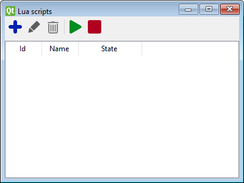
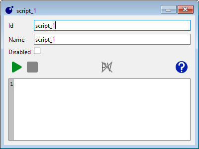

# Scripting basics

Traintastic includes a built-in **Lua scripting engine**.
Scripts allow you to extend the behavior of your world, automate tasks, and add custom logic that is not available through the standard user interface.

!!! tip
    If you get stuck or want to see what others have built, visit the [community forum scripting category](https://discourse.traintastic.org/c/lua-scripting).

## What is Lua?

Lua is a lightweight, easy-to-learn scripting language, suitable for both beginners and experienced programmers.
It is developed by a team at the **Pontifical Catholic University of Rio de Janeiro (PUC-Rio)** in Brazil and is widely used in games, embedded systems, and automation tools.

In Traintastic, Lua is embedded directly into the application, so you can write scripts that interact with your model world without installing anything extra.

!!! note
    Scripting is **completely optional**. You can enjoy Traintastic without writing a single line of code, but Lua scripts unlock powerful advanced possibilities.

## Working with scripts

To create or edit a script, open the **Lua scripts list** by selecting
**Objects → Lua scripts** from the main menu.

From this dialog you can:

-  **Create** a new script (requires *edit mode*).
-  **Edit** the selected script in the script editor.
-  **Delete** a script (requires *edit mode*).
-  **Run all** scripts, except those marked as disabled.
-  **Stop all** running scripts.

## Script editor

- A script can only be edited while it is **stopped** and **edit mode** is active.
- Use the **disabled** checkbox to prevent the script from running when pressing *Run all* in the scripts list.
- If an error occurs during execution, it will be logged in the **server log**.

## More information

- See the [Lua scripting reference](../appendix/lua/index.md) for available functions and objects.
- Check the [Lua scripting examples](../appendix/lua/examples.md) for ready-to-use ideas.
- Join the [community forum scripting category](https://discourse.traintastic.org/c/lua-scripting) to share ideas and ask questions.
- Learn more about the Lua language itself at [lua.org](https://www.lua.org).
