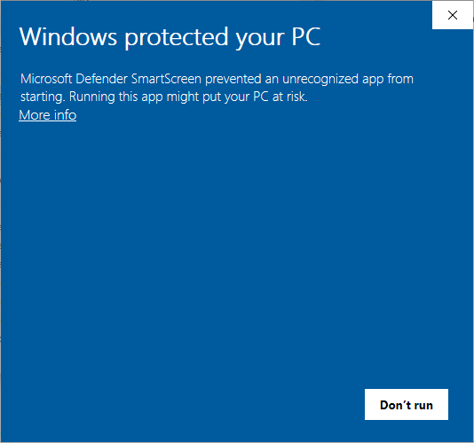
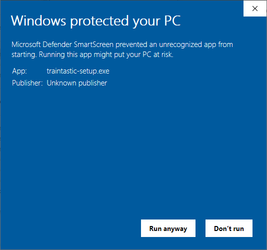
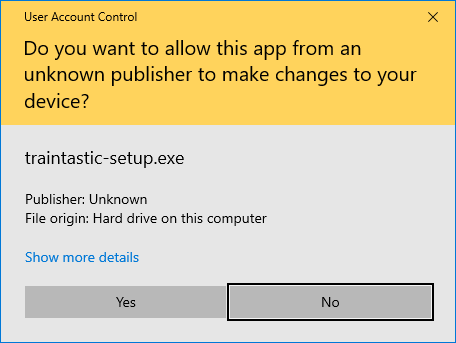
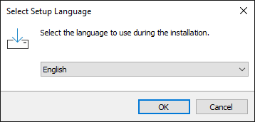
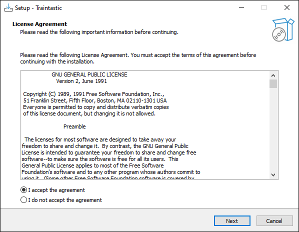
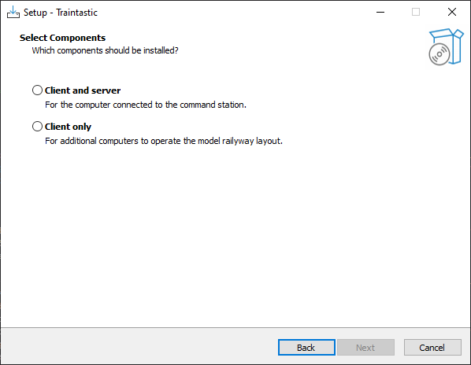
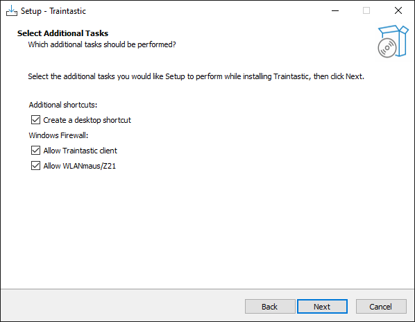
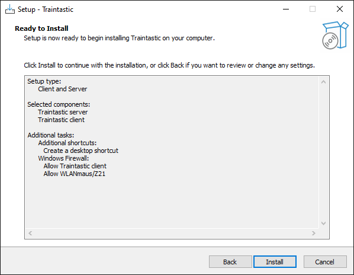
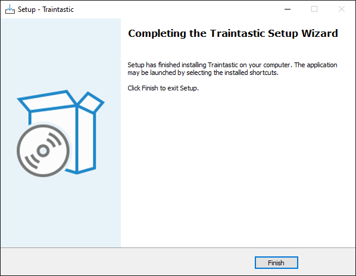

# Windows Installation

Installing Traintastic on Windows takes only a few minutes.
You’ll download the installer, allow it through Windows Defender if prompted, and follow the setup wizard.
This guide walks you through every step with screenshots so you know exactly what to expect.

Download the latest release from [traintastic.org/download](https://traintastic.org/download), run the installer and follow the steps below.

---

## Step 1: Windows Defender

Windows may warn you because Traintastic is not yet a signed application. This is expected — you can safely continue.
Click *More info* to show application information.

## Step 2: Windows Defender

Click *Run anyway* to start the installer.

## Step 3: User Account Control

Click *Yes* to allow running the installer.

## Step 4: Select Language

Select the language for the installation wizard and click *OK*.
The chosen language will also be used by Traintastic when it starts.

## Step 5: License Agreement

Select *I accept the agreement* and click *Next*.

## Step 6: Select Components

Choose the installation type:

- **Client and Server** – select this if this PC will control your model railway.
- **Client only** – select this if this PC will only connect to another Traintastic server on your network.

Then click *Next*.

## Step 7: Desktop Shortcuts and Firewall Rules

- Uncheck *Create a desktop shortcut* if you don’t want shortcuts.
- Firewall rules will be added automatically to allow other PCs and devices to connect to Traintastic. You can uncheck this if not needed.

Then click *Next*.

## Step 8: Ready for Installation

Click *Install* to start the installation of Traintastic.

## Step 9: Installation Finished

Click *Finish* to exit the installer. Installation is now complete.

---

After installation, continue with: [The Quick Start series](../quickstart/index.md).
