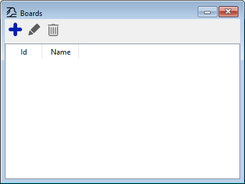

# Quick start: Drawing basics

In Traintastic, schematics are drawn on a **board**.
A board is like a canvas where you place track, turnouts, signals, and other objects to create a diagram that represents your physical railway.
You can create multiple boards, for example one for the **main layout** and another for the **hidden yard**.

## Step 1: Open the board list

1. Make sure you are in **edit mode** ( button in the top right).
2. Open the board list:
    - From the main menu: **Objects → Boards**
    - Or click the  button on the toolbar.

## Step 2: Create a new board

1. In the board list, click the  button to create a new board.
2. The **Board setup wizard** opens.
   Currently it asks only for a **board name** (e.g. *Main Layout* or *Hidden Yard*).
3. Finish the wizard to setup your board.

You can now start drawing.

## Step 3: Place and rotate tiles

1. Select a **tile** from the toolbar (straight, curve, turnout, etc.).
2. Click on the board where you want to place it.
3. To **rotate** a tile (before placing it):
    - **Right-click** — rotate clockwise
    - ++shift++ + **Right-click** — rotate counter-clockwise

## Step 4: Move tiles

1. On the toolbar, select .
2. Click on the tile you want to move.
   The tile will follow your mouse cursor.
3. Click again to place it in the new location.
    - Rotation works the same as when placing a tile.
    - To cancel moving, press ++esc++.

## Step 5: Resize tiles

Some tiles, such as blocks, can be **resized** to change their length.

1. On the toolbar, select .
2. Click on the tile you want to resize.
3. Drag the edge to increase or decrease its length.

## Step 6: Delete tiles

1. On the toolbar, select .
2. Click on the tile you want to remove.
   The tile will be deleted immediately.

---

With these basics you can start sketching your layout, adjusting as you go.

!!! tip
    If your layout is large, start by drawing just a **small portion** first.
    This helps you get familiar with the board editor before creating the full schematic.

Here’s a **simple example layout**:

We’ll use this layout in the next pages to explain how to setup **turnout control**, **blocks and sensors**, and **signals**.

Next: [Turnout control](turnouts.md)
