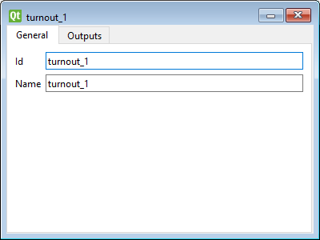

# Quick start: Turnout control

To control your layout from Traintastic, each turnout on the schematic needs to be linked to its corresponding digital outputs.
Once configured, Traintastic can switch the turnout directly and automatically update its position if the command station reports a change.

## Step 1: Configure a turnout

- Make sure you are in **edit mode** ( button in the top right).
- On the toolbar, select the  tool.
- Click on a **turnout tile** on your board — the turnout properties dialog opens. \
    
- Enter the turnout basics:
    - Enter a **name** (e.g. “Turnout 1” or “Yard Switch”).
    - The **ID** field identifies the turnout internally and can be left unchanged (mainly used for scripting).
- On the **Output** tab configure how the turnout is controlled:
    - **Interface** — The command station or interface that controls this turnout.
    - **Channel** — Usually set to *Accessory*.
    - **Address** — The digital address for the turnout on your command station.
- If the turnout has multiple addresses (e.g. **3-way**, **single slip**, or **double slip**), click  to add the additional addresses.
- The **Output mapping** defines how Traintastic translates turnout states (e.g. *straight* / *left* / *right*) to output commands.
  For most standard turnouts, the default mapping is correct.

When finished, close the dialog.

## Step 2: Test the turnout
- Switch to **operate mode**.
- Click the turnout in the schematic to change its position.
- The turnout should move on your physical layout.

!!! tip "Opposite movement?"
    If the turnout moves in the opposite direction on your layout compared to what Traintastic shows, switch back to **edit mode** and open the turnout properties again.
    On the **Output** tab, you can **swap the direction mapping** — this tells Traintastic which output corresponds to which turnout position.
    For standard turnouts that use a single address, you can do this quickly using the  button.

---

Next: [Blocks and sensors](blocks-sensors.md)
