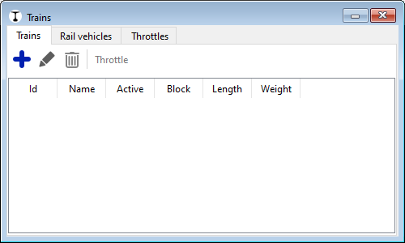
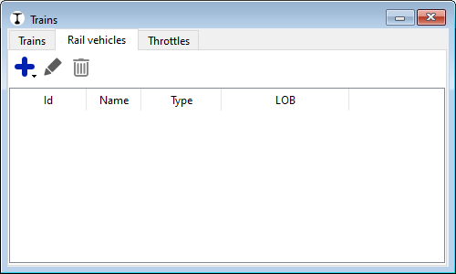
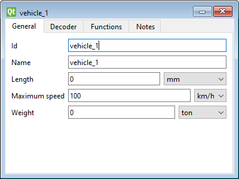
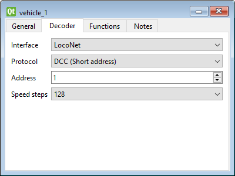
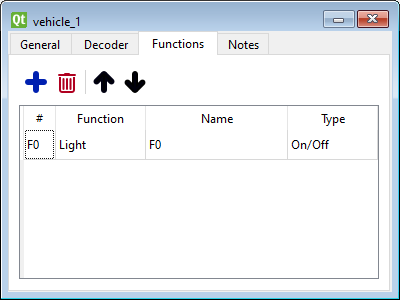
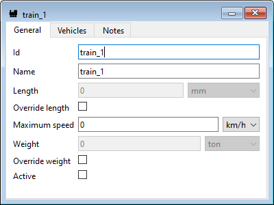
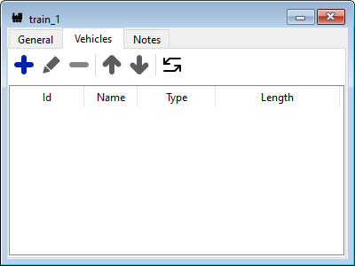
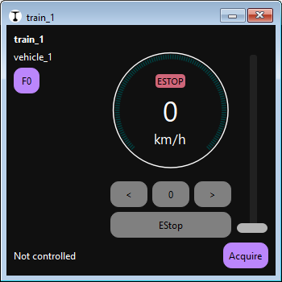
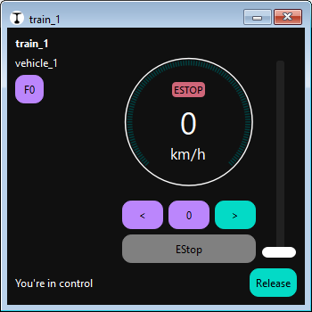

# Quick start: Add and control a train

In Traintastic, you don’t directly control *locomotives*.
Instead, you control **trains**.

A **train** is a collection of vehicles (locomotives and wagons).

- A train should contain **one or more locomotives**.
- The same locomotive or wagon can belong to **different trains**, but it can only be **active in one train at a time**.
- To operate a train, you must **activate it**. Activation only succeeds if none of its locomotives or wagons are already active in another train.

This concept makes it easy to build and re-use different train compositions.

## Step 1: Open the train list

1. Make sure you are in **edit mode** ( button in the top right).
2. Open the list in one of two ways:
    - From the main menu: **Objects → Trains**
    - Or click the **Train icon** on the toolbar.

The dialog has three tabs:

- **Trains** — define and manage your trains
- **Rail vehicles** — define and manage locomotives and wagons
- **Throttle** — list of active throttles controlling trains

## Step 2: Create a locomotive

1. Switch to the **Rail vehicles** tab. \
    
2. Click the  button and choose **Locomotive**. \
    
3. Enter the locomotive details:
    - **Name** — e.g. “BR 03” or “NS 2400”
    - **Maximum speed** — e.g. 80 km/h
4. Switch to the **Decoder** tab. \
    
5. Enter the decoder details:
    - **Interface** - The interface that controls the locomotive, if there is only one interface configured it is set automatically.
    - **Protocol** – Decoder protocol (DCC, Motorola, MFX, etc.; depends on the interface).
    - **Address** - The locomotive address
    - **Speed steps** - Number of speed steps to use (depends on the interface/protocol)
6. Switch to the **Functions** tab. \
    
7. Additional functions can be added using the  button. Double-click a function to edit its details. Function details:
    - **#** — function number: F0, F1 etc. (just enter the number)
    - **Function**
    - **Name** — Short description of the function
    - **Type**
8. Close the locomotive dialog.

## Step 3: Create a train

1. Switch back to the **Trains** tab.
2. Click the  button to create a new train. \
    
3. Enter a **name** for the train (e.g. “InterCity” or “Freight Train”).
4. Switch to the **Vehicles** tab. \
    
5. Click  and add your locomotive (and optionally wagons).
6. Close the train dialog.

The train is now defined but not yet active.

## Step 4: Control the train

1. Switch to **operate mode** (toggle the  button off).
2. Click the  button on the main toolbar, this allows train movements.
3. Double click on the train in the list, this will open a throttle. \
    
4. Click **Acquire** to activate the train and take control of speed and direction (see note below). \
    
5. Use the slider to set the speed — your train is now running!

!!! info "Train control ownership"
    In Traintastic, **only one throttle can control a train at a time**.

    - Clicking *Acquire* gives your throttle control of the train.
    - Clicking *Release* hands control back so another throttle can use it.
    - If a train is already controlled by another throttle, you can still take over by *stealing* control.

    This strict ownership model prevents conflicts and ensures each train responds to a single operator.

    *Emergency stop (E-Stop)* and *Functions (lights, sounds, etc.)* are always available **without ownership**.
