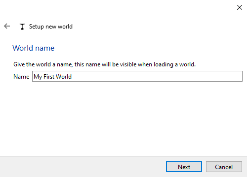
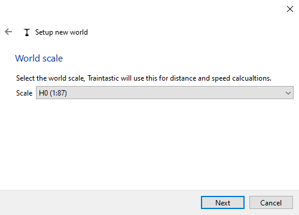
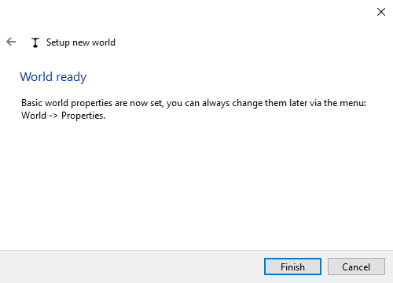

# Quick start: Create your first world

In Traintastic, everything starts with a **world**.
A world is your project file — it represents your miniature railway, including locomotives, accessories, routes, and automation.
Each builder creates their own world, just like each model railway is its own miniature universe.

## Step 1: Start the server and client

1. Start the **server** on your computer (or device such as a Raspberry Pi).
2. Start the **client**. The client automatically searches for the server and connects.

If the server has no world loaded (the default on a fresh installation), the client shows three options:

- *New world* – create a new world using a wizard
- *Load world* – open an existing world saved on this server
- *Import world* – import a world file previously exported

## Step 2: Create a new world

Click *New world* to launch the wizard:

1. Enter a **name** for your world (for example *My First World*). \
    
2. Choose the **scale** (H0, N, Z, etc.). \
    
3. Finish the wizard to create your new, empty world. \
    

## Step 3: Edit and operate modes

When a new world is created it opens in **edit mode**.
You can switch between modes using the  button in the top right corner:

- **Edit mode** – add or change objects and properties
- **Operate mode** – run trains and interact with the layout

Many properties can only be changed in edit mode. This prevents making accidental changes while operating your model railway.

## Step 4: Saving and sharing worlds

- Worlds are always saved on the **server** in a standard location.
- When saving a world, a backup is made automatically.
- To share your world (for example on the community forum or to use it on another system), use the *File* -> *Export world* function.
  - The exported file can later be imported on any server.

---

**Your new world is ready!**

The next step is to [connect to your command station](command-station.md), so Traintastic can control your layout.
