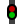

# Tiles {#tiles}

## Rail tiles {#tiles-rail}
-  Straight
-  Buffer stop
-  Curve 45°
-  Curve 90°
-  Crossover 45°
-  Crossover 90°
-  Bridge 45° (left)
-  Bridge 45° (right)
-  Bridge 90°
-  Turnout left 45°
-  Turnout left 90°
-  Turnout left curved
-  Turnout right 45°
-  Turnout right 90°
-  Turnout right curved
-  Turnout wye
-  Turnout 3-way
-  Single slip
-  Double slip
-  Block
- Sensor
-  Signal (2 aspects)
-  Signal (3 aspects)
