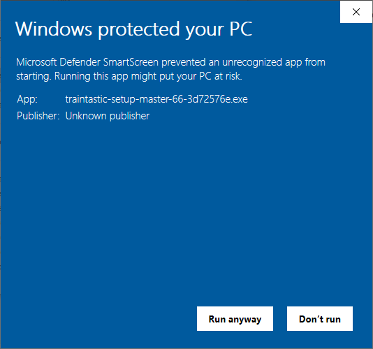
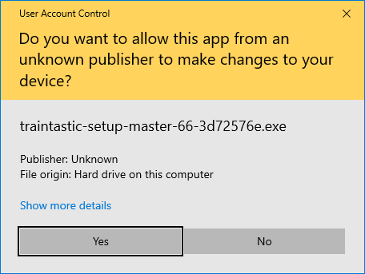
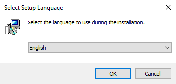
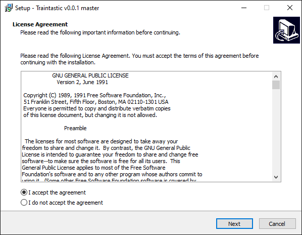
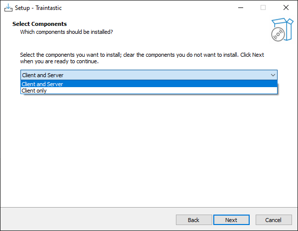
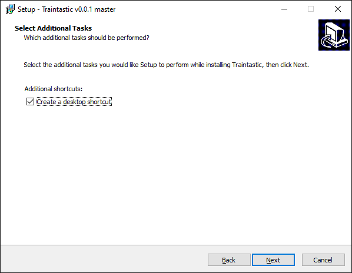
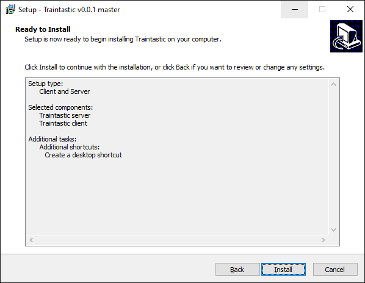
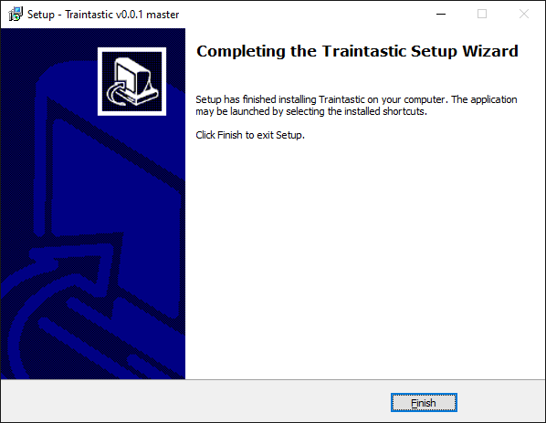

# Installation {#installation}

Installation is different based on the operating system used.
Hereafter the instructions for [Windows](#installation-windows) and [Linux](#installation-linux).

## Windows {#installation-windows}

Installation on Windows is very straight forward. Download the latest release from [traintastic.org/download](https://traintastic.org/download), run the installer and follow the steps below.

### Step 1: Windows defender

Click *More info* to show application information.

### Step 2: Windows defender

Click *Run anyway* to start the installer.

### Step 3: User Account Control

Click *Yes* to allow running the installer.

### Step 4: Select language

Select language for the installation wizard and click *Ok*.

### Step 5: Licence agreement

Select *I accept the agreement* and click *Next*.

### Step 6: Select components

Select *Client and Server* if this computer will control the layout or select *Client only* if this computer is used as additional computer to operate the layout. Then click *Next*.

### Step 7: Desktop shortcuts and firewall rules

Uncheck *Create a desktop shortcut* if you don't want desktop shortcuts to start Traintastic.
Firewall rules will be added to allow other pc's and device to connect to Traintastic, can be unchecked if not nessacary.
Then click *Next*.

### Step 8: Ready for installation

Click *Install* to start the installation of Traintastic.

### Step 9: Installation finished

Click *Finish* to exit the installer. Installation is now completed.

## Linux {#installation-linux}

Download the latest client and/or server package for your distribution at [traintastic.org/download](https://traintastic.org/download) and install is using your graphical package manager or by running `sudo dpkg -i package_name.deb` in the console.
