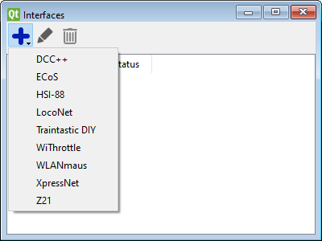

# Setup command station  {#setup-command-station}

For operating the layout Traintastic needs to know how to communicate with the command station.
To setup the communication with the command station an interface needs to be created.
Select from the main menu: *Objects* -> *Hardware* -> *Interfaces*, a dialog appears which lists all interfaces.
The world must be in *edit mode* in order to create a new interface.
To add an interface click the blue plus sign, a menu will appear with different types of interfaces:

Details about how to setup a specific command station can be found in the [supported hardware](../supportedhardware.md) section.
If required multiple interfaces can be added, e.g. an XpressNet interface for controlling the trains, turnouts and signals and a HSI-88 interface for reading feedback sensors.

When the interface is added communication can be enabled by clicking on the toolbar *connect* button or by selecting *World* -> *Connection* -> *Connect* form the main menu. Open the server log by pressing *F12* hotkey or seleting *Vie* -> *Server log* from the main menu. If an error occurs while connecting to the interface it will be shown in the server log.

When the connection is made successfully enable the track power using the toolbar button to by selecting *World* -> *Power* -> *Power on*.
