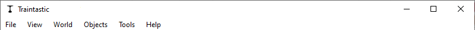

# Starting the client {#start-client}

When Traintastic server is running the Traintastic client can be started.

**Windows:** The Traintastic client can be started using the desktop icon (if installed) or by selecting *Traintastic* -> *Traintastic client* from the Windows start menu.

**Linux:** To start Traintastic client, open your desktop environment's application launcher, search for "Traintastic Client," and select it from the list.

## Connect to the server

When the Traintastic client is started a *connect to server* dialog will appear.
The Traintastic client will automatically search the local network for running Traintastic servers.
Usually there is only one Traintastic server running, connect to it by clicking on the *Connect* button.
When successful the dialog will disappear and the main application dialog becomes active.

## Main menu

TODO

### File menu

- **Connect to server**: Connect to a traintastic server.
- **Disconnect from server**: Disconnect from traintastic server.
- **New world**: Create a new empty world. If a world is loaded already it will be closed.
- **Load world**: Load a previously saved world from the server.
- **Save world**: Save the world at the server, if the world was saved before a backup is made automatically before it is overwritten.
- **Close world**: Leave the world that is currently loaded.
- **Import world**: Load a previously exported world into the server. The imported world is **not** stored on the server until the world is saved.
- **Export world**: Download a copy of the world from the server. This can be used to make an additional backup or to transfer the world to another system.
- **Quit**: Quit the application, this does not quit the traintastic server application.

### View menu

- **Full screen**: Enable/disable full screen mode.
- **Toolbar**: Show/hide the toolbar.
- **Server log**: Show/hide the server message log.

### World menu

- **Connection**: Enable/disable communication with hardware interfaces.
- **Power**: Enable/disable (track) power.
- **Stop**: Stop all vehicles.
- **Run**: Allow vehicle to move.
- **Mute**: Mute all sound effects.
- **No smoke**: Disable all smoke effects.
- **Edit world**: Enable/disable world edit mode.
- **Simulation** Enable/disable world simulation mode.
- **World properties**: Edit world properties like name and scale etc.

### Objects menu

- **Boards**: Open list of all boards, see [board](../board.md) chapter.
- **Clock**: Open the world clock. (under development)
- **Trains**: Open list of trains. (under development)
- **Rail vehicles**: Open list of rail vehicles. (under development)
- **Lua scripts**: Open list of Lua scripts, see [scripting](../scripting.md) chapter.

#### Hardware sub menu

- **Interfaces**: Open list of all interfaces.
- **Decoders**: Open list of all decoders.
- **Inputs**: Open list of all inputs.
- **Outputs**: Open list of all outputs.

### Tools menu

- **Settings**: Open application settings.

#### Server sub  menu

- **Server settings**: Edit server settings.
- **Restart server**: Restart server application.
- **Shutdown server**: Shutdown server application.

### Help menu

- **Help**: Open online manual.
- **About**: Display version and copyright information.

## Toolbar

The toolbar contains items that are frequently used when operating the layout. The toolbar can be hidden by selecting *View* -> *Toolbar* in the main menu.

### Online/offline

Toggle world online/offline, this sends a go online or go offline event to all command stations.

### Power on/off

Toggle world power, this sends a power on or power off event to all command stations.

###  Stop

Emergency stop all trains.

###  Run

Restore last known speed and direction of all trains.

###  Mute

Disable all sound functions, this requires that sound or mute decoder functions are set to the *Sound* or *Mute* type, see [decoder function function](../object/decoderfunction.md#decoder-function-function).

###  No smoke

Disable all smoke generators, this requires that all smoke generator decoder functions are set to the *Smoke* type, see [decoder function function](../object/decoderfunction.md#decoder-function-function).

### Edit mode

Traintastic as a special *edit mode*, when the world is not in edit mode most settings that define the layout can't be changed.
This prevents making accidental changes during layout operation. Changing some settings also also requires the world to be stopped.
