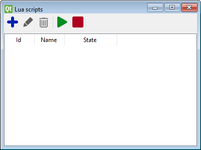

# Scripting {#scripting}

*"Where [actions](actions.md) end scripting begins."*

Traintastic has a built-in scripting engine, the scripting enginge gives ultimate control over the model world.
Using scripting all kind of things can be controled to create an even more realistic world.

Traintastic embeds a Lua scripting engine.
Lua is an easy to learn language scripting language for those with or without programmering experiance.
Lua is developed by a team at the Pontifical Catholic University of Rio de Janeiro (PUC-Rio) in Brazil.

To create or edit a script open the Lua scripts list by selecting *Objects* -> *Lua scripts* from the main menu.

-  Create a new script. (Requires *edit mode*.)
-  Edit selected script using the script editor.
-  Delete selected script. (Requires *edit mode*.)
-  Run all except disabled scripts.
-  Stop all running scripts.

## Script editor {#script-editor}

A script can only be edited while it is stopped and *edit mode* is active. The *disabled* option can be checked to make sure the script won't run when the *run all* button is pressed in the Lua script list dialog. If an error occurs during the execution of the script it will be logged in the *server log*.

See the [Lua scripting reference](lua.md) and the [Lua scripting examples](luaexamples.md) for more details about Traintastic's scripting possibilities.

For more information about Lua can be found on their website: [lua.org](https://lua.org)
